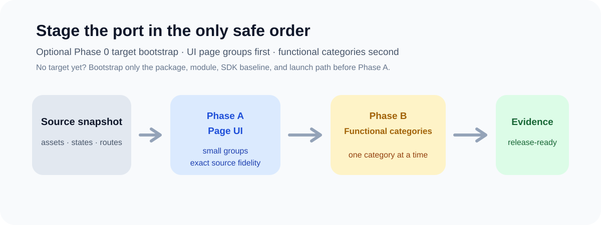
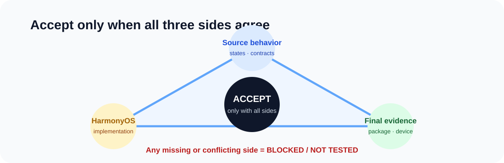

# Mobile to HarmonyOS Porting 🚀

> English | [简体中文](README.zh-CN.md)

An evidence-led Codex Skill for incrementally porting or synchronizing Android, iOS,
Flutter, React Native, and shared-native mobile capabilities into an existing HarmonyOS app.



## ✨ The non-negotiable order

**Page UI groups first. Functional categories second.**

Accept each small page group before porting its new behavior. A polished page is never
evidence that its data, hardware, service, permission, or lifecycle behavior works.

Unless the user explicitly authorizes an exception, every UI asset and visible design
choice must come from the migrated source snapshot. The Skill forbids generated,
searched, purchased, substituted, or creatively redesigned UI material. If the source
asset is missing, its access/license is unclear, or HarmonyOS cannot render it
equivalently, stop and record `BLOCKED`—do not invent a replacement.

## 🧭 What it provides

- a staged page-UI and functional-category migration playbook;
- source-to-target evidence, acceptance, and test templates;
- stop conditions for destructive data, unsupported platform behavior, stale release
  evidence, cancellation races, and shared-workspace risk;
- a Codex plugin manifest and a portable standalone Skill folder.



It does **not** translate source code automatically, provide vendor protocol
implementations, or turn missing platform/firmware evidence into a passing result.

## 📦 Install

### Option 1 — Install with Codex (recommended)

In a new Codex chat, paste this request:

```text
$skill-installer install https://github.com/yisen171121/mobile-to-harmonyos-porting/tree/main/skills/mobile-to-harmonyos-porting
```

Codex downloads the public Skill to your local skills directory. It normally discovers
the new Skill automatically; restart Codex if it is not listed on the next turn.

### Option 2 — Add it to one project

Copy the repository's `skills/mobile-to-harmonyos-porting/` folder to:

```text
<your-project>/.agents/skills/mobile-to-harmonyos-porting/
```

This keeps the workflow versioned with that project and makes it available whenever
Codex runs inside the repository.

### Option 3 — Add it for your user account

Copy the same folder to your user skills directory:

```text
~/.agents/skills/mobile-to-harmonyos-porting/
```

Use this option when you want the Skill available across projects. Restart Codex if it
does not appear after copying.

## ▶️ Invoke after installation

```text
$mobile-to-harmonyos-porting migrate this source snapshot page by page, then function category by function category.
```

You can also describe a matching porting task normally; Codex can select the Skill from
its description. Use the explicit `$mobile-to-harmonyos-porting` form when you want to
guarantee it is loaded.

## ✅ Required inputs

- readable upstream source snapshot and its access/license boundary;
- existing HarmonyOS target project and its current Git state;
- requested page and functional-category scope;
- supported devices, OS, SDK, and firmware;
- official API, SDK, and protocol sources when behavior is version-sensitive;
- permission to test real hardware or services when the requested evidence requires it.

## 🔒 Privacy and security

Never add API keys, tokens, certificates, private endpoints, customer data, proprietary
source, raw production logs, device identifiers, private protocol material, or
source-project UI assets to migration notes, tests, issues, or pull requests. Verify
source-asset licenses and access boundaries in the target project; this public
repository contains no redistributed product assets.

## 🧪 Verification status

`v0.1.0` has structure, manifest, content-safety, and scenario-coverage validation.
Independent fresh-context pressure replay is tracked in
[`evals/v0.1.0-results.md`](evals/v0.1.0-results.md) and must be completed before
treating the Skill as behaviorally proven.

## ⚖️ License

Dual-licensed under [MIT](LICENSE-MIT) or [Apache-2.0](LICENSE-APACHE), at your option.
